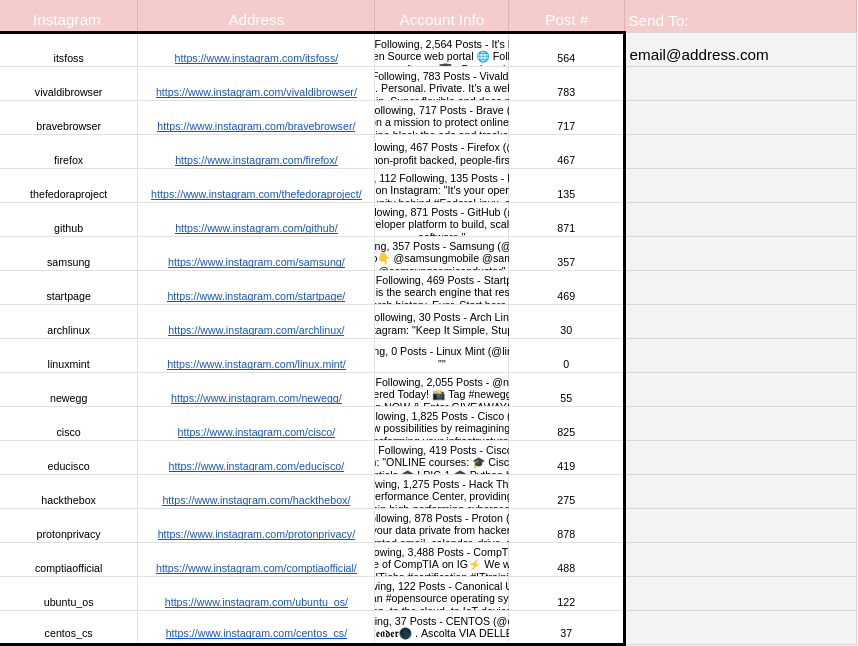

# Instagram Update Emailer

This project is a simple, Google Sheets-based tool to stay updated with Instagram accounts that post infrequently. It does not require any API connections, making it easy to set up and use. The tool monitors the post counts of specified Instagram accounts and sends an email notification when a new post is detected.

## Features
<table>
  <tr>
    <td align="center">
      
       
      <em>PNG 1</em>
    </td>

* No API Connections Needed: Simply enter Instagram usernames and the tool will handle the rest
* Customizable Email Alerts: Notifications are sent to the email address specified in cell E2
* Automatic Monitoring: Runs automatically and checks for new posts at regular intervals

## Setup

1. Copy the Google Sheet:
* Click here to copy the Google Sheet template.
* Save it to your Google Drive.
2. Add the Script:
* In the Google Sheet, go to Extensions > Apps Script.
* Replace the existing code with the code in the script.js file included in this repository.
3. Set the Recipient Email:
* Enter the email address where notifications should be sent in cell E2.
4. Authorize the Script:
* The first time you run the script, you’ll be prompted to accept permissions. Click "Authorize" to allow the script to send emails on your behalf.
5. Set Up Automatic Triggers:
* Go to Apps Script > Triggers.
* Add a new trigger for the checkForNewPosts function to run at regular intervals (e.g., every 10 minutes).
6. Start Monitoring:
* Enter the Instagram usernames you want to track in column A and their profile URLs in column B. The tool will begin checking for new posts automatically.

## Usage

### How Often It Checks for New Posts
The tool checks for new posts based on the interval set in the Google Apps Script trigger. By default, it’s set to check every 10 minutes, but this interval can be customized based on your needs.

### Email Notification Content
When a new post is detected, you’ll receive an email with the following details:

*Subject: '[Instagram Username]' made a new Instagram post today!
Body: The message will include a link to the Instagram profile with the new post:

Check it out at '[Instagram Profile URL]'*

## Author

[booknite]

## License

This project is licensed under the MIT License.

